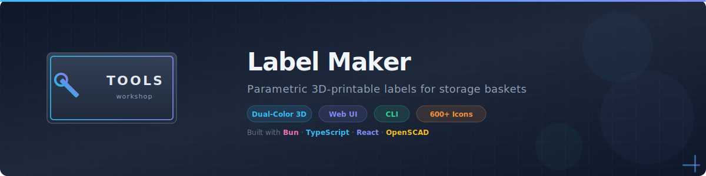
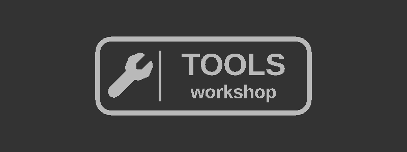
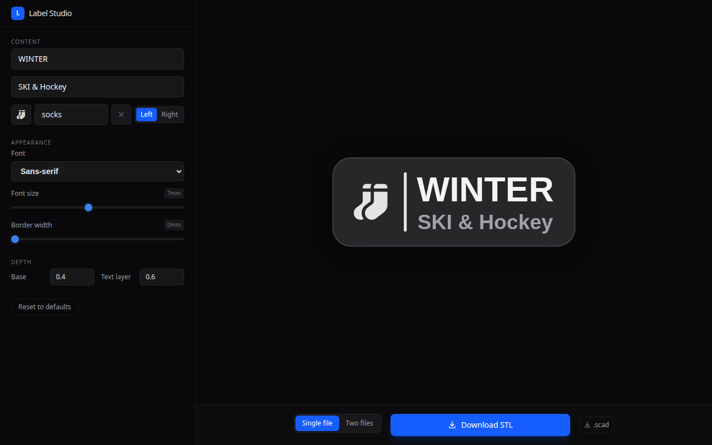

<div align="center">

<picture>
  <source media="(prefers-color-scheme: dark)" srcset=".github/assets/banner.svg">
  <source media="(prefers-color-scheme: light)" srcset=".github/assets/banner.svg">
  
</picture>

<br>

[](https://github.com/20lives/Big-Storage-Basket-System-Label-Maker/actions/workflows/ci.yml)
[](LICENSE)
[](https://bun.sh)
[](https://www.typescriptlang.org/)

**Generate beautiful dual-color 3D-printable labels for storage baskets.**<br>
Web UI with live preview · 600+ Font Awesome icons

[Web App](#-web-ui) · [Printing Guide](#-dual-color-printing) · [Contributing](CONTRIBUTING.md)

</div>

<br>

<div align="center">
  
  <br>
  <sub>Example: dual-color label with icon, border, and subtitle</sub>
</div>

<br>

## Highlights

- **Dual-color ready** — generates separate base and top layers for multi-color 3D printing
- **Web UI** — browser-based editor with real-time 3D preview (via OpenSCAD WASM)
- **600+ icons** — built-in Font Awesome icon library
- **Fully parametric** — width, height, font size, border, corner radius, and more

## Quick Start

```bash
# Install dependencies
bun install

# Launch the web UI
bun run dev
```

> **Prerequisites:** [Bun](https://bun.sh) (runtime & package manager).

---

## 🖥 Web UI

Start the development server and open your browser:

```bash
bun run dev
```

The web editor lets you:
- Configure label text, dimensions, fonts, and icons
- See a live 3D preview rendered with OpenSCAD WASM
- Download STL files directly from the browser

<div align="center">
  
  <br>
  <sub>Web editor with live preview, icon picker, and STL download</sub>
</div>

---


## 🎨 Dual-Color Printing

<details>
<summary><b>Method A:</b> Single STL with filament change</summary>

1. In the web UI, choose **Single file** and download the combined STL
2. Import into your slicer
3. Add a filament change at **Z = base depth** (default: 0.4 mm)
4. Color 1 below, Color 2 above

</details>

<details>
<summary><b>Method B:</b> Two STLs (AMS / MMU / IDEX)</summary>

1. In the web UI, choose **Two files** and download the ZIP
2. Import both STLs into your slicer
3. Assign a different color/extruder to each

</details>

---

## 🏗 Architecture

```
src/
├── label.ts        # Parametric 3D model (shared with web worker)
├── fa-icons.ts     # Font Awesome icon map
└── fonts.ts        # Font path resolution

app/
├── routes/         # TanStack Start pages
├── components/     # React UI components
├── hooks/          # Custom React hooks
├── worker/         # Web Worker for WASM rendering
└── styles/         # Tailwind CSS
```

---


## Contributing

Contributions are welcome! See [CONTRIBUTING.md](CONTRIBUTING.md) for guidelines.

## Credits

Based on the [Big Storage Basket System Label Maker](https://makerworld.com/en/models/1049761-big-storage-basket-system-label-maker) on MakerWorld.

Built with [scad-js](https://github.com/scad-js/scad-js), [Bun](https://bun.sh), [TanStack Start](https://tanstack.com/start), and [Tailwind CSS](https://tailwindcss.com).

## License

[MIT](LICENSE) © [20lives](https://github.com/20lives)
